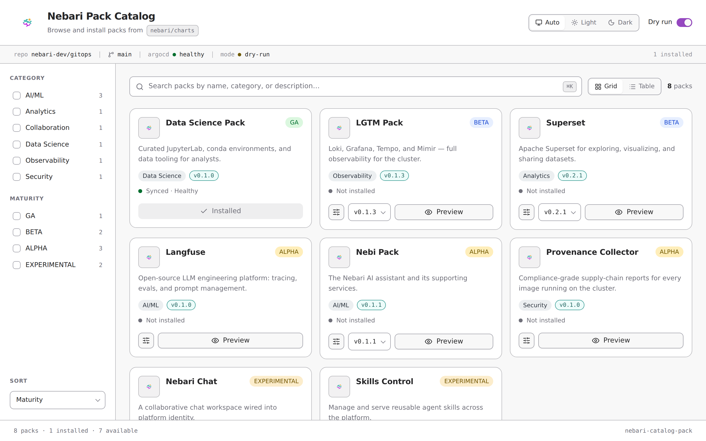
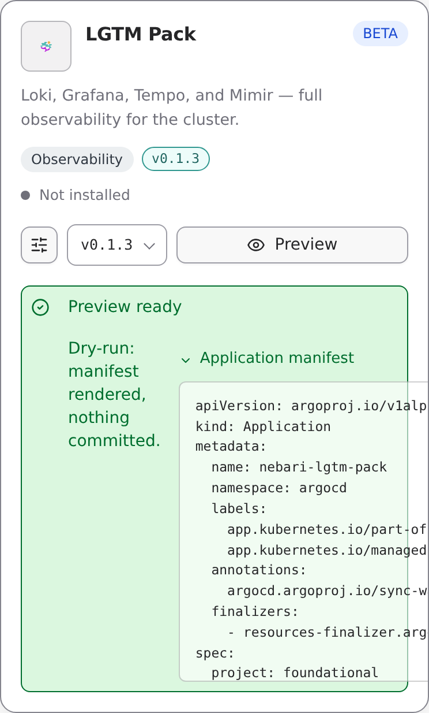
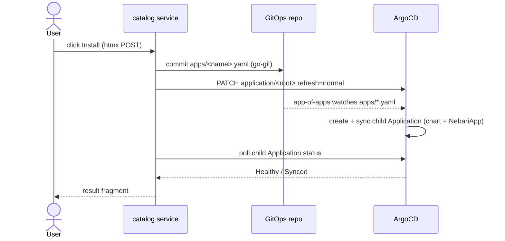

<p align="center">
  <a href="https://nebari.dev">
    <picture>
      <source media="(prefers-color-scheme: dark)" srcset="https://raw.githubusercontent.com/nebari-dev/nebari-design/main/logo-mark/horizontal/standard/Nebari-Logo-Horizontal-Lockup-White-text.png">
      <source media="(prefers-color-scheme: light)" srcset="https://raw.githubusercontent.com/nebari-dev/nebari-design/main/logo-mark/horizontal/standard/Nebari-Logo-Horizontal-Lockup.png">
      
    </picture>
  </a>
</p>

<h1 align="center">Pack Catalog</h1>

<p align="center">
  <strong>Browse your cluster's pack registry as a gallery — and install a pack with one click.</strong><br />
  A Nebari Software Pack that lists every pack published to an OCI registry (default
  <code>quay.io/nebari/charts</code>) as cards, then installs a chosen one by committing an ArgoCD
  Application straight into your GitOps repository. A pack that installs packs.
</p>

<p align="center">
  <a href="https://github.com/nebari-dev/nebari-catalog-pack/actions/workflows/ci.yml"></a>
  <a href="https://github.com/nebari-dev/nebari-catalog-pack/actions/workflows/build-image.yml"></a>
  <a href="https://github.com/nebari-dev/nebari-catalog-pack/blob/main/LICENSE"></a>
  <a href="https://github.com/nebari-dev/nebari-catalog-pack/releases/latest"></a>
  <a href="https://golang.org"></a>
</p>

<p align="center">
  <a href="#what-is-the-pack-catalog">What is it?</a> &middot;
  <a href="#what-it-does">What it does</a> &middot;
  <a href="#screenshots">Screenshots</a> &middot;
  <a href="#quick-start">Quick Start</a> &middot;
  <a href="#configuration">Configuration</a> &middot;
  <a href="#architecture">Architecture</a> &middot;
  <a href="examples/">Examples</a>
</p>

<p align="center">
  <picture>
    <source media="(prefers-color-scheme: dark)" srcset="docs/screenshots/gallery-dark.png">
    <source media="(prefers-color-scheme: light)" srcset="docs/screenshots/gallery-light.png">
    
  </picture>
</p>

> **Status**: Under active development as part of Nebari Infrastructure Core (NIC). APIs, chart values, and
> generated manifest shapes may change without notice while pre-1.0.

## What is the Pack Catalog?

The Pack Catalog is a **Nebari Software Pack** that turns your cluster's pack registry into a browsable
gallery and lets you install a pack with one click. It deploys the way every other pack does (a Helm chart
carrying a [`NebariApp`](https://github.com/nebari-dev/nebari-operator)), and it drives the same GitOps
install path that Nebari's tooling uses under the hood — so it is a pack that installs packs.

It exists because discovering *"which packs can I run, and how do I install one?"* should be a gallery and a
button, not a hand-edited ArgoCD manifest. The differentiator over a read-only dashboard is that last step:
the catalog **writes an ArgoCD `Application` into your GitOps repo and commits it**, then nudges ArgoCD to
reconcile — installing the pack through ArgoCD's own model rather than out of band.

> Curious how the pieces fit together? See the [architecture](#architecture) further down.

## What It Does

| Capability | Description |
| --- | --- |
| **Registry discovery** | Enumerates packs from a Quay/OCI registry (default `quay.io/nebari/charts`) and resolves each pack's versions. |
| **Card gallery** | Renders every pack as a card with name, description, category, maturity level, and latest version. |
| **Metadata enrichment** | Best-effort reads each pack's `pack-metadata.yaml` for display name, description, and maturity. |
| **One-click install** | Generates an ArgoCD `Application` and commits it to your GitOps repo's `apps/` directory. |
| **OCI or git source** | Sources the chart from `oci://quay.io/nebari/charts/<name>` (default) or `github.com/nebari-dev/<name>`. |
| **ArgoCD nudge** | Annotates the root app-of-apps to reconcile now, then polls the installed app to `Healthy`. |
| **Preview / dry-run** | Renders the exact `Application` it would commit without touching any repo. |

## Screenshots

One-click install previews and renders the exact ArgoCD `Application` before anything is committed:

<p align="center">
  
</p>

> Screenshots are regenerated by the Playwright harness in `test/e2e/` (`npm run screenshots`) and refreshed
> in CI by [`screenshots.yml`](.github/workflows/screenshots.yml). The UI is styled with the
> [Nebari design system](https://github.com/nebari-dev/nebari-design) — brand tokens (magenta primary, teal
> accent, zinc neutrals), Geist + IBM Plex Mono, and light/dark via `prefers-color-scheme`.

## Quick Start

### Browse locally (read-only, no cluster)

See the gallery against the live Nebari registry with no credentials:

```bash
make -f dev/Makefile run
# open http://localhost:8080/
```

This runs in dry-run mode: it lists packs from `quay.io/nebari/charts` and, on **Preview**, renders the exact
`Application` it *would* commit — without touching any repo. (`CATALOG_DEMO=true` serves a fixed offline list
instead, used for the screenshots above.)

### Operator-managed install (default)

On a Nebari cluster, drop [`examples/argocd-application.yaml`](examples/argocd-application.yaml) into your
GitOps repo's `apps/` directory (edit the `catalog.gitops.*` values to point at that same repo). ArgoCD syncs
the chart and the nebari-operator wires routing/TLS/auth from the `NebariApp`.

### Standalone install (without the Nebari Operator)

> The chart installs standalone with the `NebariApp` disabled; reach the UI via port-forward or your own Ingress.

```bash
helm repo add nebari https://nebari-dev.github.io/helm-repository
helm repo update
helm install nebari-catalog-pack nebari/nebari-catalog-pack \
  --namespace nebari-system --create-namespace \
  -f examples/standalone-values.yaml
```

Or from a local checkout:

```bash
helm install nebari-catalog-pack ./chart -n nebari-system --create-namespace -f examples/standalone-values.yaml
```

`gitops-token` (referenced in the values files) is an existing `Secret` with a `token` key holding a git PAT
that can push to the GitOps repo. Without a `gitops.repoURL` the catalog still deploys, but installs are
disabled (read-only gallery).

## Configuration

Every value maps to a `CATALOG_*` environment variable (see [`internal/config`](internal/config/config.go)).
Full list in [`chart/values.yaml`](chart/values.yaml).

| Value | Default | Purpose |
| --- | --- | --- |
| `catalog.registry.namespace` | `nebari` | registry org/namespace to browse |
| `catalog.registry.chartPrefix` | `charts` | OCI repo prefix for charts |
| `catalog.gitops.repoURL` | `""` | GitOps repo to commit Applications into (empty = read-only) |
| `catalog.gitops.path` | `""` | cluster sub-dir; apps go to `<path>/apps/` |
| `catalog.gitops.tokenSecret.name` | `""` | Secret holding a git PAT |
| `catalog.gitops.sshKeySecret.name` | `""` | Secret holding an SSH key (alternative to PAT) |
| `catalog.install.preferOCI` | `true` | source generated Apps from OCI vs git |
| `catalog.install.domain` | `""` | base domain for installed packs' hostnames |
| `catalog.argocd.rootApp` | `nebari-root` | app-of-apps to nudge after a commit |
| `catalog.dryRun` | `false` | preview manifests without committing |

The catalog can install software cluster-wide, so the chart defaults `nebariapp.auth.enabled=true` restricted
to the `admin` group.

## RBAC

The chart creates a `Role`/`RoleBinding` in the ArgoCD namespace granting the catalog only what it needs:

| Resource | Verbs | Purpose |
| --- | --- | --- |
| `applications.argoproj.io` | `get`, `list`, `watch`, `patch` | nudge the root app to reconcile and poll installed app health |

Git credentials are supplied via a referenced `Secret` and read from the environment at start — never written
into the GitOps repo. The container runs non-root with a read-only root filesystem.

## Development

```bash
make -f dev/Makefile generate     # regenerate templ components
make -f dev/Makefile test         # go test ./...
make -f dev/Makefile vet
make -f dev/Makefile image        # docker build
make -f dev/Makefile helm-lint
cd test/e2e && npm install && npm run screenshots   # regenerate UI screenshots
```

The UI is server-rendered with [templ](https://templ.guide) and [htmx](https://htmx.org) (both vendored — no
CDN, no node toolchain at runtime). Generated `*_templ.go` files are committed; CI verifies they are up to date.

## Project Structure

```
cmd/catalog            entrypoint: load config, wire dependencies, serve HTTP
internal/config        env-driven configuration (CATALOG_*)
internal/registry      Quay/OCI discovery, metadata enrichment, demo fixtures
internal/gitops        ArgoCD Application builder + go-git committer
internal/argocd        dynamic-client refresh nudge + Application status poll
internal/installer     orchestration: resolve -> render -> commit -> nudge -> wait
internal/server        HTTP routes + templ/htmx UI (internal/server/ui)
chart/                 Helm chart packaging the service as a pack
examples/              ArgoCD Application + values for operator/standalone installs
test/e2e/              Playwright screenshot harness
docs/                  architecture notes + screenshots
```

## Architecture

ArgoCD does not write to git — the catalog does, and ArgoCD syncs. Full design in
[`docs/architecture.md`](docs/architecture.md).



## Contributing

```bash
git clone https://github.com/nebari-dev/nebari-catalog-pack
cd nebari-catalog-pack
make -f dev/Makefile test
```

Issues and PRs welcome. See the [architecture notes](docs/architecture.md), the
[examples](examples/), and `pack-metadata.yaml` for how this pack surfaces on the
[Nebari pack dashboard](https://github.com/nebari-dev/software-pack-dashboard). Contributing and
code-of-conduct guidance is inherited org-wide from [`nebari-dev/.github`](https://github.com/nebari-dev/.github).

## License

[Apache 2.0](LICENSE) — same as the rest of the Nebari Infrastructure Core stack.
