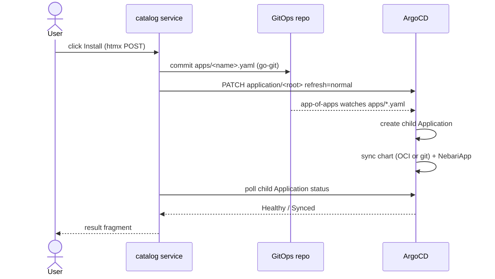

# Architecture

`nebari-catalog-pack` is a Nebari software pack whose payload is a small Go web
service. It does two things:

1. **Discover** — enumerate the software packs published to an OCI registry.
2. **Install** — write an ArgoCD `Application` for a chosen pack into the
   cluster's GitOps repository, commit it, and nudge ArgoCD to reconcile.

It is itself a pack (a Helm chart carrying a `NebariApp`), so it deploys through
the exact mechanism it drives for others.

## Components

```
cmd/catalog            entrypoint: load config, wire dependencies, serve HTTP
internal/config        env-driven configuration (CATALOG_*)
internal/registry      Quay/OCI discovery + best-effort pack-metadata enrichment
internal/gitops        ArgoCD Application builder + go-git committer
internal/argocd        dynamic-client refresh nudge + Application status poll
internal/installer     orchestration: resolve -> render -> commit -> nudge -> wait
internal/server        HTTP routes + templ/htmx UI
internal/server/ui     templ components (gallery, card, install result)
chart/                 the Helm chart that packages all of the above as a pack
```

## Discovery

The registry is enumerated through the Quay REST API, because the OCI
`/v2/_catalog` endpoint returns an empty list on quay.io:

1. `GET <api>/repository?namespace=<ns>&public=true` (paginated) — keep repos
   whose name starts with `<chart-prefix>/`; the remainder is the pack name.
2. `GET <oci>/<ns>/<prefix>/<name>/tags/list` — versions, sorted SemVer-desc.

Each pack is optionally enriched from its `pack-metadata.yaml` (display name,
description, icon, category, level) — the same convention the Nebari
software-pack dashboard consumes. Enrichment is best-effort and never blocks a
pack from appearing. Results are cached for 60s.

Defaults point at `quay.io/nebari/charts`.

## Install — the GitOps write path

ArgoCD does **not** write to git; this service does. The flow mirrors the
proven `add-software-pack` action and NIC's `pkg/argocd`/`pkg/git`:



1. **Resolve** the pack + version into a chart source. With `preferOCI` (the
   default) and a known version, the Application sources
   `oci://quay.io/nebari/charts/<name>`; otherwise it falls back to the git
   source `github.com/nebari-dev/<name>.git`.
2. **Render** an `Application` matching the established `nebari-packs`
   convention: `project: foundational`, label `part-of: nebari-packs`,
   sync-wave `7`, destination namespace `nebari-system` opted in via
   `nebari.dev/managed=true`, and a Helm `values` block carrying the
   `nebariapp` + `landingPage` contract.
3. **Commit** `apps/<name>.yaml` into the GitOps repo (go-git: clone → write →
   commit → push). The file stem equals the Application name, which is how the
   app-of-apps' directory-recursing source discovers it. A path-traversal guard
   rejects unsafe names.
4. **Nudge** ArgoCD by annotating the root app with
   `argocd.argoproj.io/refresh=normal`, then poll the child Application until it
   reports `Healthy`/`Synced` (best-effort; the commit stands regardless).

### Why a commit, not a direct API apply

The cluster's source of truth is the GitOps repo. Applying an Application
directly to the API server would drift from git and be pruned by self-heal.
Committing keeps the install auditable in git history and lets ArgoCD own the
lifecycle. (The direct-API path exists in NIC for bootstrap; here it is
deliberately not used for installs.)

## Security posture

The catalog can install software cluster-wide, so the chart defaults to
`nebariapp.auth.enabled=true` restricted to the `admin` group. The container
runs as non-root with a read-only root filesystem (git clones go to an
`emptyDir` mounted at `/tmp`). Git credentials are supplied via a referenced
Secret and read from the environment at start — never written into the GitOps
repo. RBAC grants only `get/list/watch/patch` on Applications in the ArgoCD
namespace.

## Configuration

All configuration is environment-driven (`internal/config`). The Helm chart
maps `values.yaml` → `CATALOG_*` env vars. Key knobs:

| Concern | Env / value |
| --- | --- |
| Registry | `CATALOG_REGISTRY_{API,OCI,NAMESPACE,CHART_PREFIX}` / `catalog.registry.*` |
| GitOps repo | `CATALOG_GITOPS_{REPO_URL,BRANCH,PATH}` / `catalog.gitops.*` |
| Git auth | `CATALOG_GIT_TOKEN` or `CATALOG_GITOPS_SSH_KEY_PATH` / `catalog.gitops.{tokenSecret,sshKeySecret}` |
| ArgoCD | `CATALOG_ARGOCD_{ENABLED,NAMESPACE,ROOT_APP}` / `catalog.argocd.*` |
| Source preference | `CATALOG_PREFER_OCI` / `catalog.install.preferOCI` |
| Safety | `CATALOG_DRY_RUN` / `catalog.dryRun` |

When `CATALOG_GITOPS_REPO_URL` is empty the service runs **read-only** — the
gallery renders but install is disabled.
